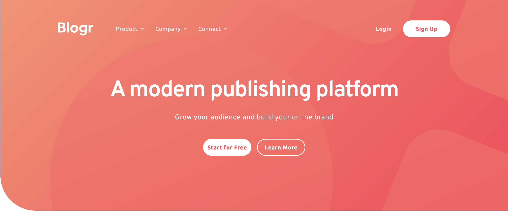
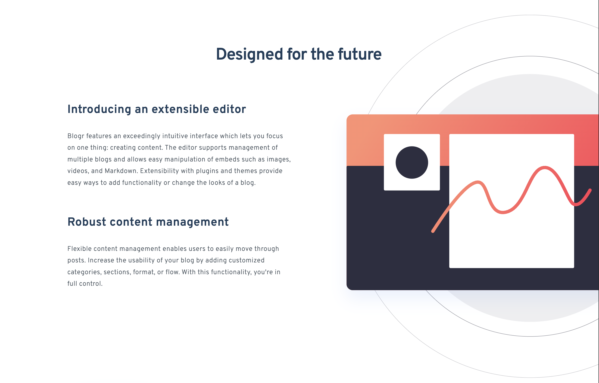
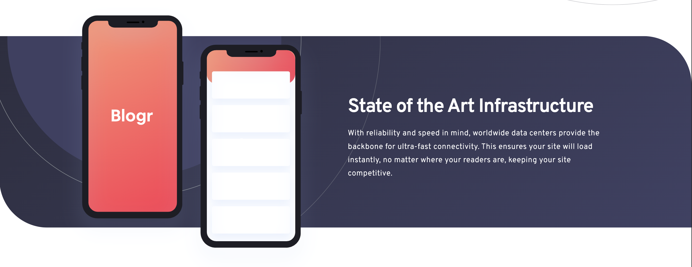
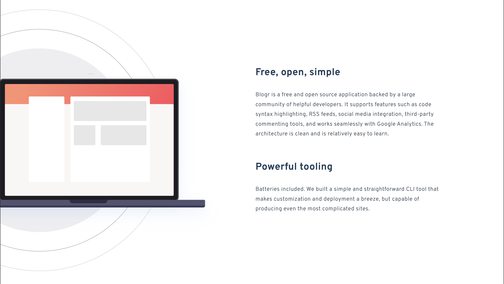
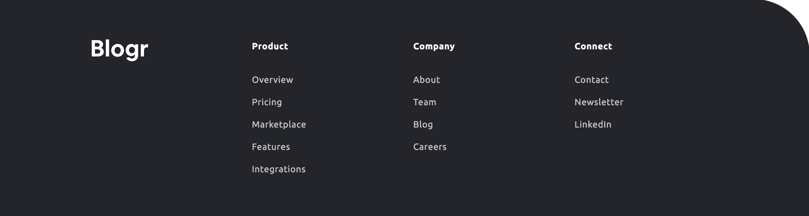

# Blogr landing page

## Table of contents

- [Overview](#overview)
  - [Screenshot](#screenshot)
  - [Links](#links)
- [My process](#my-process)
  - [Built with](#built-with)
- [Author](#author)

## Overview

### Screenshot

### Links

- Solution URL: [Solution URL](https://github.com/kisu-seo/blogr_landing_page)
- Live Site URL: [Live URL](https://kisu-seo.github.io/blogr_landing_page/)

## My process

### Built with

- **Semantic HTML5 Markup** — Page structure is built entirely with semantic elements: `<header>`, `<nav>`, `<main>`, `<section>`, `<article>`, `<footer>`, and `<ul>/<li>` for navigation lists. Each major content area is wrapped in a dedicated `<section>` with `aria-labelledby` pointing to its heading, giving screen readers a clear document outline. `<article>` is used for self-contained text blocks within sections.

- **Web Accessibility (ARIA)** — Full keyboard and screen reader support throughout:
  - `aria-expanded="false/true"` on every dropdown/accordion toggle button — updated dynamically by JavaScript to announce open/closed state to screen readers.
  - `aria-haspopup="true"` on desktop dropdown buttons signals that a sub-menu will appear on activation.
  - `aria-controls` links each toggle button to its target submenu `id` (`dd-product`, `mob-company`, etc.) for a programmatic association.
  - `aria-hidden="true"` on all decorative `` elements (arrow icons, hamburger/close icons, illustration wrappers) prevents redundant announcements.
  - `aria-label` on the hamburger `<button>` is dynamically swapped between `"메뉴 열기"` and `"메뉴 닫기"` by JavaScript as the menu toggles.
  - `aria-labelledby` on every `<section>` points to its `<h2>` (or `<h1>`) `id`, giving each landmark a descriptive name for screen reader landmark navigation.
  - `role="menubar"`, `role="menu"`, `role="menuitem"`, `role="dialog"`, `role="none"` applied throughout the navigation to conform to the WAI-ARIA Menu Button pattern.
  - `aria-modal="true"` on the mobile menu `
` signals to assistive technologies that it is a modal dialog.
  - ESC key handling via `document.addEventListener('keydown')` closes all open menus and returns focus to the hamburger button — following ARIA Authoring Practices Guide (APG) patterns for dismissible overlays.

- **Tailwind CSS (Play CDN) with Custom `tailwind.config`** — No separate `.css` file is used. All styles are applied via Tailwind utility classes. A custom `tailwind.config` object registered in a `<script>` tag extends the default theme with project-specific design tokens:
  - **Colors** (11 custom tokens): `brand-red` (#FF505C), `brand-red-lt` (#FF7B86), `brand-blue` (#1F3E5A), `gray-950` (#24242C), `gray-brand` (#4C5862), `gray-soft` (#E7E7E7), and 3 purple variants for the gradient section.
  - **Font families**: `font-overpass` (Overpass 300/600 — headings & body) and `font-ubuntu` (Ubuntu 400/700 — UI elements & buttons).
  - **Spacing scale (8px grid)**: `sp-100` (8px) through `sp-1000` (80px) — 10 semantic spacing tokens replacing magic numbers.
  - **Custom `borderRadius`**: `100px` for the section corner brand identity (hero bottom-left, footer top-right, infra section).
  - **Custom `boxShadow`**: `shadow-dropdown` (`0 20px 40px rgba(0,0,0,0.2)`) for the floating menu card and dropdown menus.
  - **Custom `maxWidth`**: `max-w-container` (1110px) for the page-wide content constraint.

- **Minimal Inline `<style>` for SVG Background Patterns** — As an intentional exception to the Tailwind-only rule, a single `<style>` block handles `.hero-bg` and `.infra-bg`. These classes apply layered `background-image` (SVG pattern + linear-gradient) with responsive `background-size` and `background-position` values that vary precisely per breakpoint. Because Tailwind CDN's Arbitrary Values cannot express multi-value responsive `background-*` shorthand, this is the only place plain CSS is written.

- **Mobile-First Responsive Design (2 Breakpoints)** — Base classes target mobile (375px). Two `min-width` breakpoints progressively enhance the layout:
  - **`md:` (768px+, Tablet)**: Navigation switches from a floating card to wider proportions; hero and section padding scales up; footer shifts from vertical stack to horizontal `flex-row`.
  - **`lg:` (1024px+, Desktop)**: Hamburger button is hidden (`lg:hidden`); the inline horizontal nav bar (`lg:flex`) appears; sections shift from `text-center` to `lg:text-left`; grid layouts activate (`lg:grid`); Break-out image transforms engage.

- **CSS Flexbox & Grid (via Tailwind)** — Flexbox is the primary layout mechanism. CSS Grid is used selectively for the editor and laptop sections on desktop:
  - `flex items-center justify-between` for the header nav bar.
  - `lg:grid lg:grid-cols-[540px_1fr]` for the Editor section — a named fixed-width column for text and `1fr` for the image, ensuring the text column never shrinks below 540px.
  - `lg:flex lg:flex-1` on the desktop nav link area to fill remaining header space between the logo and buttons.
  - `flex flex-col` (mobile) → `md:flex-row` (tablet+) for the footer link groups.

- **Break-out Image Layouts (Scale + Translate)** — Both the Editor and Laptop illustration sections use intentional "break-out" layouts where images visually overflow their parent containers:
  - **Editor** (desktop): `lg:scale-[2.05] lg:translate-x-[62%]` expands the SVG to 205% and shifts it 62% to the right, bleeding off the right edge of the viewport. `overflow-x-hidden` on `<main>` suppresses the resulting horizontal scrollbar.
  - **Laptop** (desktop): `lg:left-[-98px]` pulls the image 98px left of its container boundary. `overflow-hidden` on mobile/tablet clips it; `lg:overflow-visible` permits the overhang on desktop only.
  - **Infra phone** (all): `mt-[-251px]` (mobile) / `md:mt-[-266px]` (tablet) uses negative top margin to pull the phone illustration up, overlapping the preceding Editor section — a deliberate design detail from the Figma spec.

- **Dual-Icon Hamburger Button (HTML + `hidden` toggle)** — Instead of swapping `img.src` in JavaScript (which causes a flicker and buries file paths in JS), both the hamburger `` and close `` are declared in HTML simultaneously. JavaScript controls visibility exclusively by adding/removing Tailwind's `hidden` class (`display: none`) on each icon. This separates concerns cleanly: HTML owns asset paths, JS owns state.

- **UI State Control via Tailwind `hidden` Class** — No custom CSS classes are added or removed for show/hide logic. The single Tailwind utility class `hidden` (equivalent to `display: none`) is the sole mechanism for toggling visibility of: the mobile menu card, all dropdown `<ul>` lists, all accordion `<ul>` sub-menus, and the close icon. `classList.add('hidden')` hides; `classList.remove('hidden')` shows.

- **CSS Attribute Selector + `aria-expanded` for Arrow Animation** — The dropdown arrow rotation is driven entirely by a CSS attribute selector in the inline `<style>` block: `[aria-expanded="true"] .arrow-rotate { transform: rotate(180deg); }`. When JavaScript updates `aria-expanded` on a button, CSS automatically rotates its child `.arrow-rotate` image. This means no JS `style` mutations are needed — the accessibility attribute doubles as the CSS hook.

- **Event Delegation Pattern (Vanilla JS)** — Instead of attaching `click` listeners to each of the 6 menu buttons individually, a single listener is registered on the nearest common ancestor (`#mobile-menu` for accordion, `[role="menubar"]` for desktop dropdowns). The handler uses `event.target.closest(selector)` to identify whether a valid button was clicked. This reduces active listener count, avoids forEach loops over NodeLists, and means new menu items added later require zero JS changes.

- **Magic String Elimination via Constants** — Repeated string literals (`'aria-expanded'`, `'aria-controls'`, `'hidden'`) are extracted into `const` declarations at the top of `script.js`. This prevents typo-induced silent failures, enables IDE autocomplete, and makes global renaming a one-line change.

- **Accordion Pattern (Mutual Exclusion)** — Mobile sub-menus implement a mutual-exclusion accordion: `closeAllMobileSubmenus()` is always called before opening a new sub-menu. This guarantees at most one sub-menu is open at any time without tracking state explicitly — the DOM's `aria-expanded` attribute is the single source of truth for current state.

- **`stopPropagation` for Dropdown / Document Click Coordination** — Desktop dropdown buttons call `event.stopPropagation()` to prevent their click from bubbling to the `document`-level "click outside" handler. Without this, the dropdown would open and immediately close in the same event cycle. This is the only use of `stopPropagation` in the codebase — a surgical, minimal application of event cancellation.

- **Responsive Image Pair (`block`/`hidden` Swap)** — For the Editor and Laptop sections, two `` tags coexist (one mobile SVG, one desktop SVG). `class="block lg:hidden"` shows the mobile version and hides it on desktop; `class="hidden lg:block"` does the inverse for the desktop version. This is CSS-only art direction — no JavaScript, no `<picture>` element needed because the SVGs differ in detail level, not just crop.

- **Google Fonts via `<link rel="preconnect">`** — Two `<link rel="preconnect">` tags pre-warm DNS + TCP + TLS connections to `fonts.googleapis.com` and `fonts.gstatic.com` before the stylesheet request fires. The `crossorigin` attribute on the `gstatic.com` preconnect is required because the font binary is fetched cross-origin. Fonts loaded: **Overpass** (weights 300, 600) and **Ubuntu** (weights 400, 700) with `display=swap` to prevent invisible text during font loading.

- **JSDoc Documentation** — All JavaScript functions are annotated with JSDoc block comments (`/** ... */`) specifying `@file`, `@param`, `@returns`, and `@type` tags. Inline comments explain *why* a design decision was made (e.g., why `stopPropagation`, why `closest()`, why `aria-expanded` as state source) rather than restating *what* the code does. Section dividers and a top-level file docblock provide at-a-glance orientation for any new contributor.

- **Window Resize Guard** — A `resize` event listener on `window` calls `setMobileMenuState(false)` whenever `window.innerWidth >= 1024`. This resets the mobile menu and icon state when a user resizes the browser from mobile width to desktop width, preventing a broken UI state where the mobile menu remains open in a desktop layout.

## Author

- Website - [Kisu Seo](https://github.com/kisu-seo)
- Frontend Mentor - [@kisu-seo](https://www.frontendmentor.io/profile/kisu-seo)
